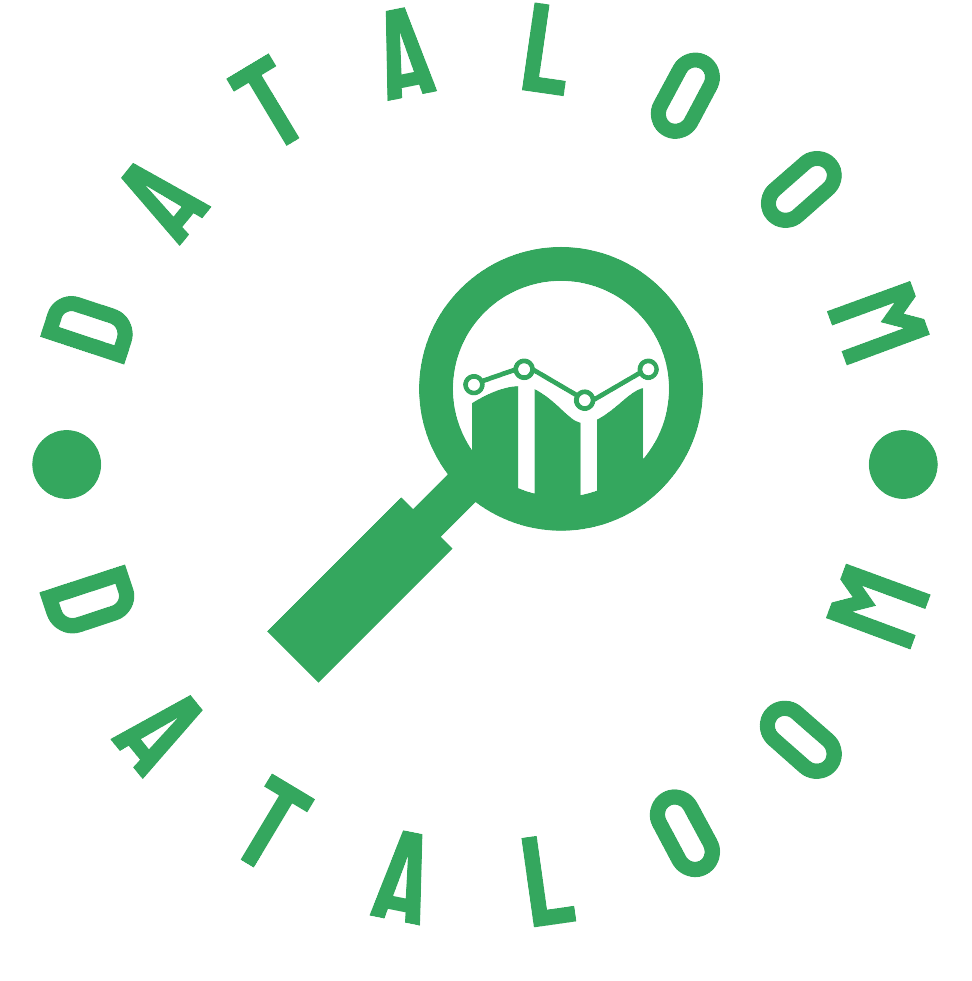

# DataLoom


> Enquanto o projeto está em desenvolviemnto, esta branch será tratada como produção. Assim, os entregáveis estarão todos nas branchs chamadas "release", com a devida identificação da sprint.

# Inteli - Instituto de Tecnologia e Liderança 

<p align="center">
  
</p>

# Estrutura e governança para análise de dados - Appdata voltado para vendedores e gerentes

## Grupo 1 - DataLoom


<br>

### 🚀 Integrantes
- <a href="https://www.linkedin.com/in/ana-clara-zaidan/">Ana Clara Müller</a>
- <a href="https://www.linkedin.com/in/bruno-omeira/">Bruno Meira </a>
- <a href="https://www.linkedin.com/in/felipe-saadi/">Felipe Saadi</a>
- <a href="https://www.linkedin.com/in/jordan-acs/">Jordan Andrade</a>
- <a href="https://www.linkedin.com/in/mateus-neves-3b767123b/">Mateus Neves</a>
- <a href="https://www.linkedin.com/in/priscila-falc%C3%A3o-3435a1244/">Priscila Falcão</a>
- <a href="https://www.linkedin.com/in/sofia-moreiras-pimazzoni/">Sofia Pimazzoni</a>

## 🔍 Sumário

| Tópicos|
|---|
| [Descrição](#-descrição)|
| [Como começar](#-como-começar)|
| [Estrutura de pastas](#-estrutura-de-pastas)|
| [Instalação](#-instalação)|
| [Tecnologias](#-Tecnologias) |
| [Histórico de lançamentos](#-histórico-de-lançamentos)|
| [Licença/License](#-licençalicense)|
| [Referências](#-referências)|


## 📜 Descrição

O projeto visa desenvolver uma ferramenta de análise de dados para a empresa de cosméticos, com foco em melhorar a comunicação de informações e dados entre a empresa e seus vendedores e gerentes. O objetivo é criar um sistema que processe dados de vendas e produtos, os limpe, organize e os apresente de forma personalizada para gerentes e vendedores através de um aplicativo móvel. A ferramenta fornece insights sobre o desempenho de cada vendedor, ajudando a aumentar o engajamento e a performance da equipe. Além da ferramenta, o projeto inclui a criação de uma estrutura de governança de dados e documentação detalhada sobre o fluxo de dados e o uso da ferramenta.


## 📍 Como Começar:

1. Clone este repositório.
2. Instale as dependências necessárias.
3. 
4.


## 📁 Estrutura de pastas

```
├── 📁 docs
│   ├── 📁 apresentacoes
│   ├── 📝
│   ├── 📝
│   ├── 📝
├── 📁 src
│   ├── 📁 pipeline
│   ├── 📁 backend
│   ├── 📁 frontend
├── 📝 README.md

```

      
Dentre os arquivos e pastas presentes na raiz do projeto, definem-se:

- <b>README.md</b>: arquivo que serve como guia e explicação geral sobre o projeto (arquivo atual).

- <b>/docs</b>: as documentações geradas no desenvolvimento do projeto.
    - <b>/apresentacoes</b>: os slides utilizados nas sprint reviews.

- <b>/src</b>: os artefatos que compõem o sistema. 

  - <b>pipeline</b>: esteira para o processamento dos dados.

  - <b>backend</b>: controle do sistema, autenticação e regras de negócio.

  - <b>frontend</b>: DataApp, a interface que poderá ser acessada pelos usuários.


## 🔧 Instalação

Para a instalação desse projeto, é necessário ter alguns recursos instalados na máquina que irá executar. Nota-se que além das instalações necessárias, também destaca-se que é relevante a versão de cada uma dessas tecnologias, visto que podem ocorrer falhas na execução, devido a configuração do projeto.

## 👨‍💻 Tecnologias
- R Notebook

## 📖 Histórico de lançamentos

**Versão 1.0 — 16/08/2024 (Sprint I)**

* Configuração de ambiente
* Notebook inicial de análises
* Template de arquitetura
* Estruturação da documentação
* Definição de requisitos
* Criação de user stories
* Arquitetura de negócio
* Exploração de dados;

**Versão 2.0 — 30/08/2024 (Sprint II)**

* 

* 

* 


**Versão 3.0 — 13/09/2024 (Sprint III)**

* 


**Versão 4.0 — 27/09/2024 (Sprint IV)**

* 
  

**Versão 5.0 — 11/10/2024 (Sprint V)**

* 


## 📋 Licença/License

<p xmlns:cc="http://creativecommons.org/ns#" xmlns:dct="http://purl.org/dc/terms/"><a property="dct:title" rel="cc:attributionURL" href="#">DataLoom</a> by <a rel="cc:attributionURL dct:creator" property="cc:attributionName" href="#">Inteli, Ana Clara Müller, Bruno Meira, Felipe Saadi, Jordan, Mateus Neves, Priscila Falcão dos Santos, Sofia Pimazzoni.
</a> is 
licensed under <a href="http://creativecommons.org/licenses/by/4.0/?ref=chooser-v1" target="_blank" rel="license noopener noreferrer" style="display:inline-block;">Attribution 4.0 International</a></p>

## 🎓 Referências

