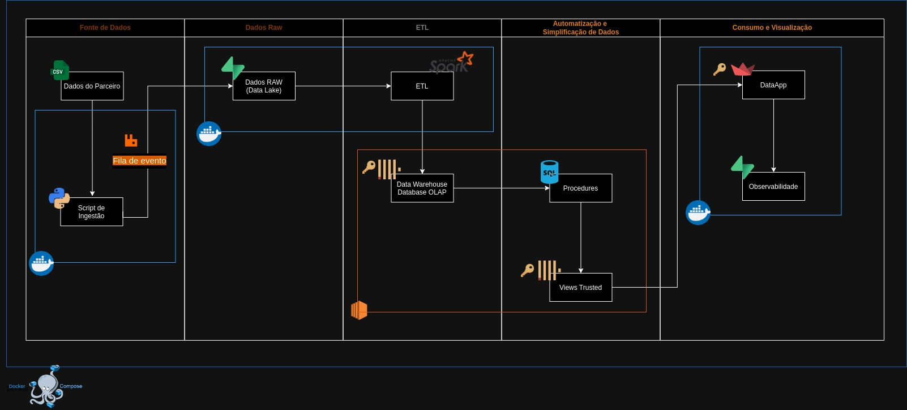
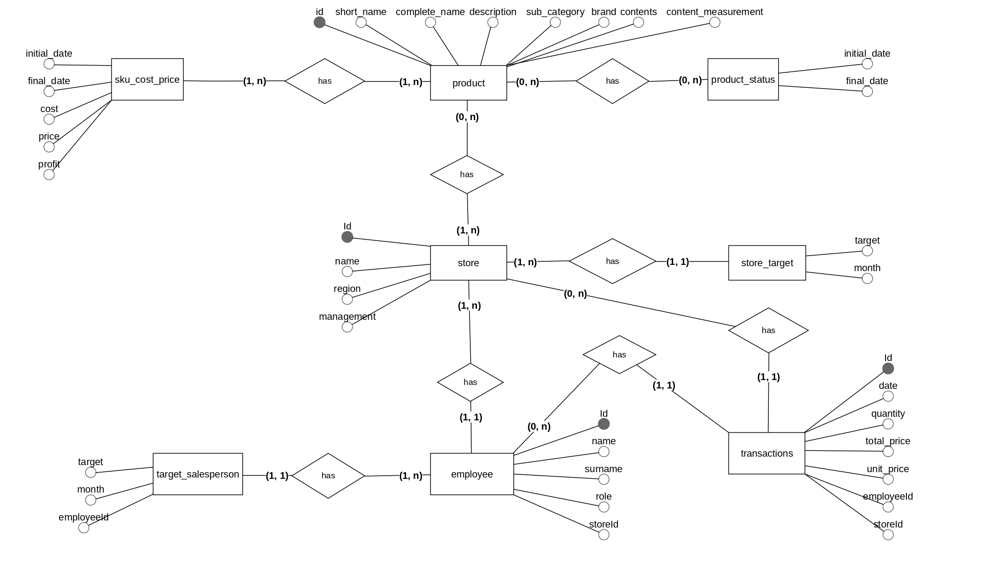
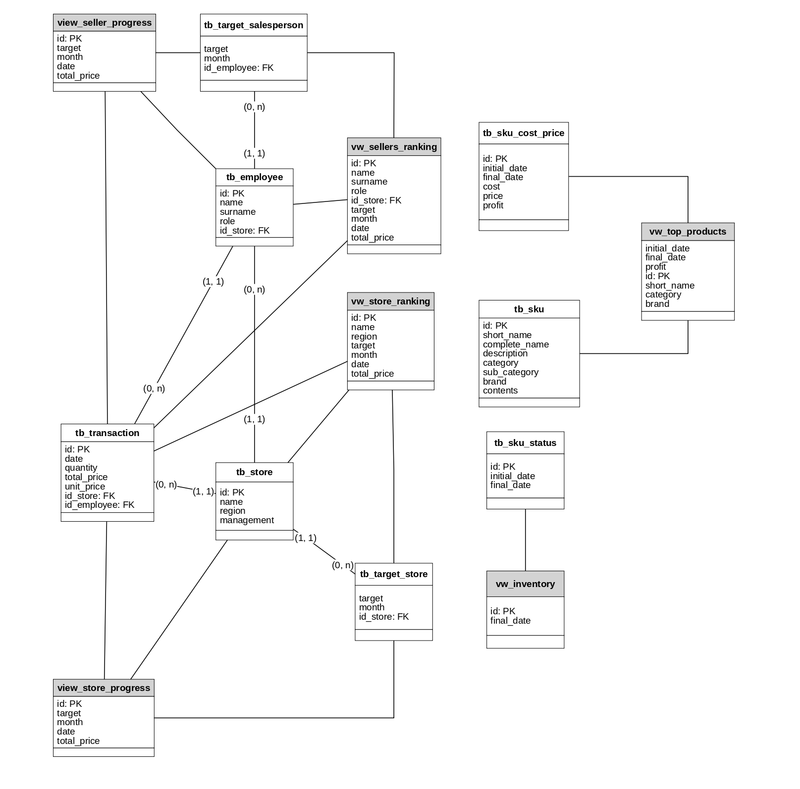
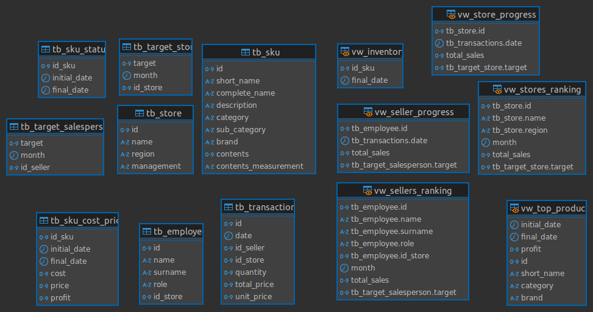

# Arquitetura de Dados

Documento baseado nos padrões TOGAF e IEEE.

## Tabela de Conteúdos
  - [1. Visão da Arquitetura](#1-visão-da-arquitetura)
    - [1.1 Problema](#11-problema)
    - [1.2 Stakeholders](#12-stakeholders)
    - [1.3 Restrições](#13-restrições)
    - [1.4 Escopo](#14-escopo)
  - [2. Especificação de Requisitos](#2-especificação-de-requisitos)
    - [2.1 Requisitos Funcionais](#21-requisitos-funcionais)
    - [2.2 Requisitos Não Funcionais](#22-requisitos-não-funcionais)
    - [2.3 User Stories](#23-user-stories)
  - [3. Arquitetura do Sistema](#3-arquitetura-do-sistema)
    - [3.1 Diagramação da Arquitetura](#31-diagramação-da-arquitetura)
    - [3.2 Modelo Conceitual](#32-modelo-conceitual)
    - [3.3 Modelo Lógico](#33-modelo-lógico)
    - [3.4 Modelo Físico](#34-modelo-físico)
    - [3.5 Tecnologias Definidas](#35-tecnologias-definidas)
    - [3.6 Benefícios da Arquitetura](#36-benefícios-da-arquitetura)
  - [4. Gestão de Mudança](#4-gestão-de-mudança)
    - [4.1 Funções Definidas](#41-funções-definidas)
    - [4.2 Acompanhamento de Resultados](#42-acompanhamento-de-resultados)
    - [4.3 Processo para Alteração de Artefatos](#43-processo-para-alteração-de-artefatos)
    - [4.4 Processo para Alteração de Requisitos](#44-processo-para-alteração-de-requisitos)
    - [4.5 Processo para Alteração de Arquitetura](#45-processo-para-alteração-de-arquitetura)
    - [4.6 Integridade dos Dados](#46-integridade-dos-dados)
  - [5. Mitigação de Riscos](#5-mitigação-de-riscos)
    - [5.1 Riscos](#51-riscos)
    - [5.2 Mitigação dos Riscos](#52-mitigação-dos-riscos)
  - [6. Diagrama de fluxos e processos](#6-diagrama-de-fluxos-e-processos)
    - [6.1 Diagrama vendedor: realização de cross-sell com o cliente](#61-diagrama-vendedor-realização-de-cross-sell-com-o-cliente)
    - [6.2 Diagrama gerente: visualização de dados para tomada de decisões estratéticas](#62-diagrama-gerente-visualização-de-dados-para-tomada-de-decisões-estratéticas)
  - [7. Considerações de Governança (Segurança)](#7-considerações-de-governança-segurança)
    - [7.1 Pontos de Segurança Identificados na Arquitetura](#71-pontos-de-segurança-identificados-na-arquitetura)
    - [7.2 Considerações Estratégicas da Arquitetura e Planos de Ação](#72-considerações-estratégicas-e-planos-de-ação)
  - [8. Monitoramento e gerenciamento](#8-monitoramento-e-gerenciamento)
  - [9. Integridade dos dados](#9-integridade-dos-dados)
  - [10. Wireframe Agnóstico de Dashboard](#10-wireframe-agnóstico-de-dashboard)

## 1. Visão da Arquitetura

### 1.1 Problema

Uma grande varejista de cosméticos com mais de 200 lojas nas regiões Sul e Sudeste do Brasil, enfrenta desafios na comunicação entre seu setor corporativo e as lojas, incluindo gerentes e vendedores. Um dos principais problemas está relacionado aos modelos de remuneração variável, que são complexos e não são bem compreendidos pelos vendedores e gerentes. Essa falta de clareza e comunicação gera um alto índice de turnover, baixo engajamento dos vendedores, e uma performance geral abaixo do esperado.

Além disso, existe uma lacuna na visualização dos dados das vendas e produtos, não sendo claro quais os produtos mais vendidos, recomendações de cross-sell, somado a recomendações de substituição e outros.

### 1.2 Stakeholders

Os envolvidos no projeto desenvolvido englobam:
- Vendedores: Os vendedores são os usuários finais primários do DataApp, pois eles terão acesso direto à ferramenta e poderão visualizar suas próprias informações de desempenho e remuneração. Esses terão a oportunidade de acompanhar suas métricas individuais, entender melhor os modelos de remuneração e receber feedbacks e orientações para melhorar sua performance.

- Gerentes: Os gerentes são outros usuários primários do DataApp, pois eles utilizarão a ferramenta para monitorar e gerenciar o desempenho de sua equipe de vendas. Eles terão acesso a painéis de dados abrangentes, que lhes permitirão acompanhar métricas de vendas, taxas de conversão, satisfação do cliente e outros indicadores importantes. Com essas informações, os gerentes poderão tomar decisões mais embasadas, identificar tendências, diagnosticar problemas e implementar ações corretivas ou de desenvolvimento para sua equipe.

- Clientes: Embora os clientes não sejam usuários diretos do DataApp, eles são os beneficiários finais das melhorias de desempenho proporcionadas pela ferramenta. À medida que a equipe de vendas se torna mais eficiente e engajada, a experiência e a satisfação dos clientes tendem a melhorar. 

### 1.3 Restrições

Por se tratar de um DataApp, os dados tornam um fator para restrições no app, uma vez que nem todos podem estar disponíveis para qualquer usuário.

1) A classificação de todos os vendedores: As informações sobre a classificação geral de todos os vendedores serão acessíveis apenas aos gerentes. Cada vendedor terá acesso apenas à sua própria colocação em relação ao desempenho geral da equipe, sem visualizar as posições dos demais colegas. Essa abordagem garante a privacidade e evita comparações diretas entre os vendedores, promovendo um ambiente de trabalho mais colaborativo.

2) Rankeamento das lojas: O ranqueamento das lojas será visível apenas para os gerentes. Essa funcionalidade permitirá que os gerentes tenham uma visão clara do posicionamento de cada loja em relação à região, possibilitando a tomada de decisões estratégicas mais embasadas. O acesso restrito a esse tipo de informação garante que as decisões estratégicas sejam tomadas de forma responsável e alinhada com os objetivos da organização.

3) Desempenho de cada vendedor (comissão): As informações sobre a comissão e desempenho de cada vendedor estarão disponíveis apenas para o próprio vendedor e para o gerente responsável. Os vendedores poderão acompanhar seus próprios dados de desempenho, como volume de vendas, taxa de conversão e comissão, sem ter acesso aos dados dos colegas. Essa abordagem promove a privacidade e evita que os vendedores façam comparações diretas entre si, incentivando uma cultura de desenvolvimento individual e colaboração. Os gerentes terão acesso a esses dados para poder acompanhar, avaliar e fornecer feedback personalizado a cada membro da equipe de vendas.

4) Produtos recomendados para cross-sell: Essa funcionalidade será acessível para os vendedores, permitindo que eles visualizem sugestões personalizadas de produtos que podem ser adquiridos junto com o item principal. As recomendações serão baseadas em análises de dados de compras anteriores, preferências dos clientes e padrões de comportamento de consumo. Ao oferecer essas recomendações, a equipe de vendas poderá aumentar a taxa de conversão e o valor médio do pedido, beneficiando tanto a empresa quanto os clientes.

6) Produtos substitutos: Essa funcionalidade permitirá que os vendedores identifiquem alternativas aos produtos que os clientes estão interessados, podendo oferecer opções similares ou com características equivalentes. A disponibilidade dessas informações contribuirá para uma melhor assessoria aos clientes, proporcionando uma experiência de compra mais satisfatória e fortalecendo o relacionamento com a marca.

### 1.4 Escopo

A empresa deseja desenvolver um pipeline de dados com políticas de governança eficazes, que possibilite a criação de um DataApp para visualização de informações personalizadas sobre os vendedores e gerentes. Primeiramente, o DataApp irá melhorar a comunicação e o entendimento dos modelos de remuneração adotados pela empresa. Ao fornecer acesso a informações claras e transparentes sobre as estruturas de comissão e bônus, os funcionários poderão compreender melhor como sua performance e esforços são recompensados. Isso contribui para uma maior motivação e engajamento da equipe de vendas, uma vez que eles terão visibilidade sobre os fatores que influenciam sua remuneração.

Além disso, a ferramenta proporcionará insights valiosos sobre o desempenho dos vendedores e gerentes. Através de painéis de dados personalizados, a liderança poderá acompanhar métricas-chave, como volume de vendas, taxa de conversão, substituição de produtos e outros indicadores relevantes. Essa visibilidade aprimorada permitirá que a empresa identifique rapidamente áreas de melhoria, tendências e oportunidades de desenvolvimento.

## 2. Especificação de Requisitos

Definição e acompanhamento dos requisitos estabelecidos para o sistema.

### 2.1 Requisitos Funcionais

**RF01** - O sistema deve permitir a visualização gráfica da projeção de vendas em diferentes períodos de tempo.

**RF02** - O sistema deve permitir que o vendedor e gerente visualizem suas vendas em relação a sua meta diária, mensal e anual,  de maneira percentual.

**RF03** - O sistema deve apresentar um gráfico que mostre detalhadamente o modelo de remuneração dos vendedores, incluindo comissões e outros componentes de forma individualizada.

**RF04** - O sistema deve fornecer recomendações automáticas de produtos que são frequentemente vendidos juntos.

**RF05** - O sistema deve apresentar de forma simples, quais produtos possuem a maior margem de lucro dentro da Cosmetics.Co.

**RF06** - O sistema deve possuir um ranking anônimo das vendas dos vendedores e das lojas.

**RF07** - O sistema deve possuir uma ferramenta de simulação de remuneração que permite aos vendedores e gerentes criar cenários personalizados.

**RF08** - O sistema deve permitir consultas em tempo real ao estoque disponível na loja.

### 2.2 Requisitos Não Funcionais

**RNF01** - O sistema deve garantir confiabilidade nos dados apresentados para vendedores e gerentes, permitindo apenas 3% de erros apresentados.

**RNF02** - A governança dos dados deve respeitar todas as regras da LGPD, além de priorizar que o privacy by design guie o funcionamento do sistema. 

**RNF03** - A interface deve ser intuitiva e de fácil entendimento, visto que busca atender público diverso de usuários. Os gráficos e informações dos dados devem ser claros o suficiente por si só para entendimento. 

**RNF04** - A interface deve ser responsiva para que possa ser acessada de diferentes dispositivos. Nota-se que o desenvolvimento deve ser mobile first.

**RNF05** - O sistema deve garantir disponibilidade de 70%, para que as consultas possam ser feitas durante horário de trabalho e atendimento dos clientes.

### 2.3 User Stories

**US01** - Como vendedor, eu quero visualizar uma projeção de vendas personalizada para diferentes períodos de tempo, a fim de  gerenciar melhor as minhas vendas e minhas metas.

**US02** - Como vendedor, eu quero acompanhar as minhas vendas em relação à minha meta mensal, a fim de saber o quão longe estou de atingi-la.

**US03** - Como vendedor, eu quero visualizar meu modelo de remuneração de forma gráfica, a fim de diferenciar e identificar os diferentes componentes de forma individualizada, como a comissão das vendas.

**US04** - ⁠Como vendedor, eu quero receber recomendações de quais produtos são frequentemente vendidos juntos na Cosmetics.Co, a fim de otimizar minhas indicações de produtos, e aumentar minhas vendas.

**US05** - ⁠Como vendedor, eu quero acessar, de forma intuitiva e clara, quais os produtos que possuem maior margem de lucro, a fim de direcionar as vendas e recomendá-los para os clientes, aumentando o lucro da empresa.

**US06** - Como vendedor, eu quero visualizar um ranking anônimo com as vendas do mês por parte dos colaboradores, a fim de me motivar para vender mais, e comparar meu desempenho com os demais.

**US07** - ⁠Como vendedor, eu quero simular a remuneração para diferentes cenários personalizados, a fim de melhorar o gerenciamento das minhas vendas e minhas metas.

**US08** - ⁠Como vendedor, gostaria de receber recomendações de produtos substitutos para um desejado, a fim de otimizar minhas recomendações para os clientes, aumentando minhas vendas

**US09** - Como gerente, eu quero visualizar uma projeção de vendas personalizada da minha unidade para diferentes períodos de tempo, a fim de  gerenciar melhor as vendas da unidade.

**US010** - ⁠Como gerente, eu quero acompanhar as vendas da minha unidade em relação à meta mensal da loja, a fim de saber o quão longe estamos de atingi-la.

**US011** - Como gerente, eu quero visualizar um ranking anônimo com as vendas do mês por parte das unidades da Cosmetics.Co, a fim de entender melhor o desempenho da minha unidade, e compará-lo  com as demais.

**US012** - Como gerente, eu quero simular a remuneração para diferentes cenários personalizados, a fim de melhorar o gerenciamento das vendas da minha unidade.

## 3. Arquitetura do Sistema

### 3.1 Diagramação da Arquitetura
Diagrama da infraestrutura definida para a solução.

*Arquitetura V2:*

A arquitetura de dados foi desenvolvida para garantir a eficiência, escalabilidade e segurança no processamento e consumo de dados. Ela é dividida em várias etapas, começando pela Fonte de Dados, onde os dados são fornecidos por parceiros no formato CSV. Para ingestão, utilizamos um script em Python devido à sua simplicidade e à vasta biblioteca de suporte para manipulação de arquivos CSV e integração com filas de mensagens. O script lê os arquivos e envia os dados para uma fila de eventos implementada com RabbitMQ para o Data Lake, que garante a entrega confiável e ordenada dos eventos de forma assíncrona, desacoplando a ingestão do processamento subsequente. Todo esse processo é encapsulado em containers Docker, o que facilita a replicação do ambiente em diferentes infraestruturas.

Na Camada de Dados RAW, os dados brutos são armazenados em um Data Lake gerenciado pelo Supabase. Esta plataforma, similar ao S3 da AWS, foi escolhida por ser open-source e fácil de integrar, além de oferecer controle de acesso, versionamento e uma interface simples para gestão dos dados. O Supabase também é containerizado, garantindo consistência e escalabilidade no armazenamento.

O processo de ETL (Extração, Transformação e Carregamento) é realizado pelo Apache Spark, uma plataforma de processamento de dados distribuído altamente eficiente, capaz de transformar os dados brutos em estruturados, prontos para análise. Os dados transformados são armazenados no ClickHouse, um banco de dados OLAP de alto desempenho, otimizado para consultas analíticas em tempo real em grandes volumes de dados. Ambos os processos, ETL e Data Warehouse, são executados em containers Docker, garantindo um ambiente de execução isolado e consistente.

Na Automatização e Simplificação de Dados, utilizamos procedimentos armazenados no Data Warehouse para automatizar e simplificar consultas complexas. As Views Trusted são criadas para fornecer uma interface segura e simplificada aos dados transformados, garantindo a integridade das consultas. Estas operações também são configuradas dentro do container do Data Warehouse.

Para o Consumo e Visualização, desenvolvemos um DataApp utilizando Streamlit, que permite criar dashboards e aplicações web de forma rápida e simples, ideal para visualizações em tempo real. A integração com o Supabase oferece autenticação e ferramentas de observabilidade internas, eliminando a necessidade de infraestruturas adicionais para monitoramento de desempenho e segurança. Tanto o DataApp quanto o Supabase são compatíveis com Docker, permitindo fácil configuração, implantação e escalabilidade.

No contexto geral, optamos pelo uso extensivo de Docker e Docker Compose para encapsular todos os componentes do sistema, garantindo portabilidade e consistência no ambiente de desenvolvimento, teste e produção. Docker Compose orquestra todos os containers, facilitando a replicação do ambiente em diferentes máquinas e na nuvem.

O ClickHouse, utilizado como Data Warehouse, será implementado diretamente em uma instância EC2 na AWS. Os dados serão armazenados de forma persistente e confiável em um banco de dados PostgreSQL, garantindo a integridade e a durabilidade das informações, mesmo em cenários onde a instância EC2 possa ser temporariamente reiniciada ou substituída.

Por fim, a Governança de Dados será gerida através de um rigoroso controle de acesso, onde cada usuário terá permissões específicas. Este controle será feito por meio da autenticação no DataApp e pela criação de usuários e perfis no ClickHouse, assegurando que cada pessoa tenha acesso apenas às informações que lhe são pertinentes, garantindo a segurança e a privacidade dos dados.

### 3.2 Modelo Conceitual

#### 1. **Produto --> SKU Cost Price**
   - **Cardinalidade à Esquerda** (Produto):
     - (1, n): Cada produto deve ter pelo menos um SKU Cost Price, mas pode ter muitos ao longo do tempo.
   - **Cardinalidade à Direita** (SKU Cost Price):
     - (1, n): Cada SKU Cost deve estar associado a pelo menos um produto inicialmente, mas pode estar associado a muitos produtos.

#### 2. **Produto --> Product Status**
   - **Cardinalidade à Esquerda** (Produto):
     - (1, n): Cada produto deve ter pelo menos um Product Status, mas pode ter muitos ao longo do tempo.
   - **Cardinalidade à Direita** (Product Status):
     - (1, 1): Um Product Status deve estar associado a somente um produto já que trata de um produto especifico em um periodo de tempo especifico.

#### 3. **Produto --> Store**
   - **Cardinalidade à Esquerda** (Produto):
     - (0, n): Um produto pode estar disponível em várias lojas ou em nenhuma loja.
   - **Cardinalidade à Direita** (Store):
     - (1, n): Uma loja deve ter pelo menos um produto, mas pode ter muitos produtos.

#### 4. **Store --> Store Target**
   - **Cardinalidade à Esquerda** (Store):
     - (1, n): Cada loja deve ter pelo menos uma Store Target definida, mas pode ter várias ao longo do tempo.
   - **Cardinalidade à Direita** (Store Target):
     - (1, 1): Uma Store Target deve estar associado a somente um loja já que trata de uma loja especifica em um periodo de tempo especifico.

#### 5. **Store --> Employee**
   - **Cardinalidade à Esquerda** (Store):
     - (1, n): Cada loja deve ter pelo menos um funcionário, mas pode ter muitos funcionários.
   - **Cardinalidade à Direita** (Employee):
     - (1, 1): Cada funcionário deve estar associado a somente uma loja.

#### 6. **Employee --> Target Salesperson**
   - **Cardinalidade à Esquerda** (Employee):
     - (1, n): Cada funcionário deve ter pelo menos uma meta de vendas associada a ele, mas pode ter várias metas ao longo do tempo.
   - **Cardinalidade à Direita** (Target Salesperson):
     - (1, 1): Uma Employee Target deve estar associado a somente um funcionário já que trata de uma funcionário especifico em um periodo de tempo especifico.

#### 7. **Employee --> Transactions**
   - **Cardinalidade à Esquerda** (Employee):
     - (0, n): Um funcionário pode não ter realizado nenhuma transação, mas pode ter realizado várias.
   - **Cardinalidade à Direita** (Transactions):
     - (1, 1): Cada transação deve estar associada a somente um funcionário.

#### 8. **Store --> Transactions**
   - **Cardinalidade à Esquerda** (Store):
     - (0, n): Cada loja pode não ter nenhuma transação, mas pode ter várias.
   - **Cardinalidade à Direita** (Transactions):
     - (1, 1): Cada transação deve estar associada a somente uma loja.

### 3.3 Modelo Lógico

O modelo lógico é uma evolução do modelo conceitual previamente apresentado. Durante a fase de modelagem conceitual, foram identificadas as principais entidades e os relacionamentos entre elas, levando em consideração as necessidades do negócio e os requisitos funcionais. A partir desse ponto, na modelagem lógica, essas entidades foram transformadas em tabelas na nossa camada prata, cada uma com seus atributos específicos. Essas tabelas são estruturadas com três colunas principais: "data da ingestão", "dados" e "tag". Além disso, os relacionamentos foram ajustados para refletir a forma como os dados serão efetivamente armazenados e acessados.

O modelo lógico inclui várias tabelas, cada uma representando uma entidade. As principais tabelas incluem:

- **tb_employee**: Contém informações sobre os funcionários, como ID, nome, sobrenome, cargo, e a loja à qual estão associados.
- **tb_store**: Representa as lojas, com detalhes como ID, nome, região e gerenciamento.
- **tb_transaction**: Armazena informações sobre as transações, incluindo a data, quantidade, preço total, preço unitário, e as referências à loja e ao funcionário envolvidos.
- **tb_sku**: Detalha os produtos, incluindo o ID, nomes (curto e completo), descrição, categoria, subcategoria, marca e conteúdos.
- **tb_sku_cost_price**: Mantém o histórico de custos e preço dos SKUs ao longo do tempo.
- **tb_sku_status**: Registra o status dos SKUs, monitorando datas de início e fim.

Além dessas tabelas, o modelo lógico inclui seis views (`vw_`) que são usadas para relatórios e análises de dados na nossa camada gold que serve de consumo e visualização no nosso DataApp, como ranking de vendedores e lojas, produtos mais vendidos, e inventário, segue descrição das nossas views definidas:

1. **vw_sellers_ranking**: Esta view oferece um ranking dos vendedores com base em seu desempenho, considerando o alvo (`target`) mensal, e as vendas realizadas (`total_price`). Ela combina informações do vendedor, como nome e sobrenome, com o total vendido no mês.

2. **vw_store_ranking**: Esta view apresenta um ranking das lojas, ordenando-as com base em sua performance em relação ao alvo (`target`) e às vendas totais (`total_price`). Isso permite comparar a eficácia de cada loja dentro da região e ao longo de períodos específicos.

3. **vw_top_products**: A view "Top Products" lista os produtos de maior desempenho, identificando aqueles que geraram maior lucro (`profit`) durante um período. Ela ajuda a identificar os produtos mais rentáveis e os que mais contribuíram para o faturamento da empresa.

4. **vw_inventory**: Esta view monitora o inventário, fornecendo um resumo das datas de início e fim para cada SKU no sistema. Ela auxilia na gestão do estoque, permitindo uma visão clara dos produtos disponíveis em qualquer ponto no tempo.

5. **view_seller_progress**: A view "Seller Progress" acompanha o progresso dos vendedores em relação ao alvo estabelecido para eles, considerando o mês e o total de vendas (`total_price`). É útil para avaliar o desempenho individual de cada vendedor ao longo do tempo.

6. **view_store_progress**: Semelhante à view anterior, esta monitora o progresso das lojas, comparando o total de vendas realizadas com o alvo mensal. Ela ajuda na análise de desempenho das lojas em diferentes períodos e sob diversas condições econômicas.

### 3.4 Modelo Físico
A modelagem física foi desenvolvida com foco na estrutura de armazenamento e de buscas do CLickHouse, o que tem como objetivo otimizar o armazenamento e a consulta dos dados, seguindo uma estrutura em camadas. A camada prata é representada por tabelas que armazenam os dados processados e consolidados, servindo como uma base intermediária para análises detalhadas. Essas tabelas foram projetadas para garantir eficiência na ingestão e no processamento de dados. Além disso, foram criadas views que compõem a camada ouro. Essas views agregam, transformam e organizam os dados da camada prata para facilitar a análise e o consumo pelos usuários finais. A camada ouro, portanto, oferece uma forma simplificada e otimizada para consultas analíticas, aproveitando a performance do ClickHouse para fornecer insights rápidos e precisos para consulta.

A transição do modelo lógico para o modelo físico é um passo importante no processo da modelagem do banco de dados, em que a estrutura abstrata definida no modelo lógico é refinada e adaptada para implementação real em um sistema de gerenciamento de banco de dados (Dbeaver). Durante a fase de modelagem lógica, foram estabelecidas as tabelas, seus atributos e os relacionamentos entre elas, focando na integridade dos dados e na clareza das interações entre as diferentes partes do sistema. 

Este formato de modelagem, é composto por um diagrama UML e um conjunto de scripts SQL que definem as tabelas e as views. A modelagem física não só descreve a estrutura das tabelas, mas também os tipos de dados através de uma simbologia própria. 

#### Script .sql  
A criação do banco de dados é coberta pelas queries presentes [neste arquivo .sql](modelagem_fisica.sql).

#### Diagrama uml

- ferramenta utilizada: dbeaver

### 3.5 Tecnologias Definidas

Descrição das tecnologias utilizadas e o motivo de suas escolhas.

### 3.6 Benefícios da Arquitetura

Prós e contras das decisões arquiteturais definidas.

## 4. Gestão de Mudança

### 4.1 Funções Definidas

Descrição dos responsáveis e suas funções em relação a solução.

### 4.2 Acompanhamento de Resultados

Definição das estratégias de monitoramente de resultados.

### 4.3 Processo para Alteração de Artefatos

Definição do processo realizado para mudanças de artefatos (criação e modificação).

### 4.4 Processo para Alteração de Requisitos

Definição do processo realizado para mudanças de requisitos (criação e modificação).

### 4.5 Processo para Alteração de Arquitetura

Definição do processo realizado em casos de mudanças arquiteturas.

### 4.6 Integridade dos Dados

Para garantir a integridade dos dados desde o momento inicial de ingestão até o momento de consumo final nas visualizações dos usuários, serão efetuados processos pré-estabelecidos de tratamento e transformação, resultando em um aumento da qualidade e da consistência dos dados, comparados ao estado inicial de recebimento deles.

Nesse contexto, os processos a serem efetuados são:

*Conversão para parquet:* os dados serão otimizados para garantir uma maior performance e diminuição do tamanho necessário para armazená-los. Assim como uma grande melhora nas consultas, reduzindo drásticamente o tempo de resposta ao buscar posteriormente os dados armazenados no clickhouse. Além de performance, a escolha do parquet contribui para a consistência dos dados, minimizando a chance de corrupção ou inconsistências durante o armazenamento e a consulta;

*Tratamento de dados:* haverá uma padronização do tamanho das colunas pré-estabelecidas juntamente com os nomes da tabelas importadas e suas colunas, identificando se os arquivos armazenados no data lake respeitam as estruturas necessários para o nível prata/ouro. Como adicional, serão realizados tratamentos avançados, verificando os tipos dos dados de cada coluna e seus dados, e se conferem com os padrões definidos. Também serão realizadas tratativas para garantir que sempre que novos dados forem ingeridos no sistema, apenas dados novos que não estejam contidos no data warehouse sejam inseridos, protegendo contra duplicidade de dados;

*Transformações de dados*: Serão realizadas conversões nos dados nulos para dados utilizáveis de forma não danosa, garantindo os resultados corretos, e a criação de novas colunas com base no cruzamento de dados relevantes que serão necessárias para features de visualização, por exemplo. Além disso, serão removidos dados sensíveis não essenciais, que não fazem parte das consultas dos usuários, garantindo o cumprimento das normas de LGPD mapeadas no plano de governança do projeto.

Para garantir a conformidade definida, serão realizadas auditorias periódicas de acordo com a disponbilidade dos integrantes do grupo, com apoio dos instrutores de computação,  negócios, e orientadora. Dessa forma, tornando possivel a garantia de que os processos de integridade dos dados estão sendo realizados corretamente, assim como os resultados estão de acordo com as necessidades da organização.

Por fim, as modelagens, arquiteturas e políticas de governança são reconhecidas como documentos "vivos", e deverão ser revisadas periódicamente em detrimento de novas demandas e insights, a fim de garantir uma melhora contínua no plano de integridade dos dados utilizados.

## 5. Mitigação de Riscos

### 5.1 Riscos

Definição de riscos da solução.

### 5.2 Mitigação dos Riscos

Descritivo das estratégias definidas para lidar com cada risco identificado.

## 6. Diagrama de fluxos e processos

### 6.1 Diagrama vendedor: realização de cross-sell com o cliente

**Descrição do Fluxograma:**

Este fluxograma apresenta o processo de cross-selling na loja CosmeticCo, descrevendo como a interação entre cliente, vendedor e uma ferramenta de apoio chamada DataApp pode resultar em uma experiência de compra mais completa e potencialmente mais lucrativa para a empresa.

<u>Cliente:</u> O processo se inicia com o cliente entrando na loja da CosmeticCo em busca de um produto específico. Após chegar à loja, o cliente procura um vendedor para auxiliá-lo na localização do item desejado.

<u>Vendedor:</u> O vendedor, ao ser abordado, ajuda o cliente a encontrar o produto que ele deseja. Nesse momento, o vendedor tem a opção de seguir dois caminhos:

*   finalizar a venda apenas com o produto que o cliente procurou inicialmente
*   explorar a oportunidade de realizar uma venda cruzada (cross-sell), sugerindo um produto adicional que complemente a compra original.

<u>DataApp:</u> Caso o vendedor decida explorar o cross-sell, ele acessa o DataApp, uma ferramenta projetada para oferecer, entre outras funcionalidades, recomendações de produtos complementares. Essas sugestões são baseadas em análises do comportamento de compra de outros clientes, que adquiriram itens adicionais em conjunto com o produto em questão. O DataApp utiliza esses dados, aliados a estratégias de venda previamente definidas, para identificar o produto complementar mais adequado que o vendedor pode recomendar ao cliente.

<u>Cliente (Interação com a sugestão):</u> Após receber a recomendação do DataApp, o vendedor faz a sugestão ao cliente, oferecendo o produto adicional. O cliente, então, decide se aceita ou não a sugestão. Esse ponto é uma bifurcação importante no processo:

* Se o cliente recusar a recomendação, ele procede apenas com a compra do produto inicial e o processo de venda é finalizado.
* Se o cliente aceitar a sugestão do vendedor, ele adquire ambos os produtos, concluindo o processo com uma compra mais robusta.

### 6.2 Diagrama gerente: visualização de dados para tomada de decisões estratégicas

**Descrição do Fluxograma:**

Este fluxograma descreve um processo de tomada de decisões estratégicas, baseado na visualização de dados, que envolve o uso de uma ferramenta de análise para acompanhar o desempenho da loja e da equipe de vendas. O fluxo é estruturado de forma a orientar o gerente na identificação de métricas importantes e na tomada de decisões com base em informações objetivas.

<u>Gerente:</u> O processo inicia-se com o gerente percebendo um aumento significativo nas vendas da sua loja no mês atual. Reconhecendo esse resultado positivo, o gerente manifesta interesse em saber se a loja está próxima de atingir a meta de vendas estabelecida.

Para obter uma visão mais detalhada, o gerente decide consultar o DataApp, uma ferramenta que lhe fornece dados precisos sobre o progresso da loja.

<u>DataApp:</u> Ao acessar o DataApp, o gerente visualiza que a loja está próxima de alcançar a meta mensal de vendas. Essa informação confirma o bom desempenho, mas o gerente decide aprofundar sua análise para obter uma compreensão mais completa da situação. Ele verifica outras análises disponíveis no sistema e descobre que sua loja ocupa a primeira posição no ranking regional, o que reforça o sucesso obtido.

Diante dessa informação, o gerente resolve examinar como o desempenho individual dos vendedores está contribuindo para esse resultado geral. O DataApp aponta que um vendedor específico teve uma performance acima da média, destacando-se dos demais.

<u>Decisão do Gerente:</u> Com esses dados em mãos, o gerente é levado a um momento decisório, sendo apresentado a ele duas opções:
*  Ele pode optar por não agir com base nas informações obtidas, encerrando o processo. 
* Como também pode optar em fornecer um feedback positivo ao vendedor que apresentou um desempenho excepcional. Ao optar por essa abordagem, o gerente não apenas reconhece o esforço do colaborador, mas também reforça uma cultura de reconhecimento e motivação dentro da equipe.

<u>Vendedor:</u> Ao receber esse feedback positivo, o vendedor sente-se valorizado pelo seu desempenho superior, o que, por sua vez, aumenta o seu engajamento e compromisso com os objetivos da loja. Esse reconhecimento contribui para o desenvolvimento de um ambiente de trabalho mais motivador e orientado para resultados.

## 7. Considerações de Governança (Segurança)

As considerações de segurança foram realizadas com base na arquitetura desenvolvida para o projeto. Nesta análise, foram identificados pontos críticos que podem comprometer a integridade dos dados e a segurança geral do sistema. Além disso, foram sugeridas melhorias essenciais que devem ser implementadas para mitigar esses riscos.

### 7.1 Pontos de Segurança Identificados na Arquitetura

1. **Armazenamento dos Dados Brutos no Bucket**
   - Os dados são inicialmente armazenados em um Bucket para posterior processamento. Este ponto apresenta um risco de segurança significativo, pois atualmente não há mecanismos de autenticação adequados implementados.

2. **Processamento dos Dados pelo Apache Spark**
   - O processamento dos dados ocorre em um cluster do Apache Spark. As principais considerações de segurança aqui incluem o controle de acesso ao cluster e a proteção do tráfego de dados na rede.

3. **API de Comunicação da Aplicação com os Usuários**
   - A segurança desta API deve priorizar a autenticação, autorização e a implementação de limitação de taxa (rate limiting) para prevenir abusos e ataques.

### 7.2 Considerações Estratégicas e Planos de Ação

1. **Criptografia dos Dados Armazenados e em Trânsito**
   - Os dados armazenados no Bucket devem ser criptografados para garantir sua segurança. O plano de ação inclui a implementação de criptografia assimétrica para proteger os dados em repouso. Além disso, é fundamental garantir a segurança dos dados em trânsito na rede, seja no tráfego entre o Bucket e o banco de dados ClickHouse, ou no tráfego de dados da API. A utilização de criptografia SSL/TLS é recomendada para garantir a segurança dos dados em trânsito.

2. **Revisão e Implementação de Políticas de Acesso**
   - O acesso ao Bucket, ao ClickHouse, ao Cluster Apache Spark e à API deve ser rigorosamente controlado para garantir a segurança da aplicação. A proposta inclui a criação de grupos de segurança distintos para cada componente da arquitetura, assegurando que apenas usuários autorizados tenham acesso. Para a API, recomenda-se a implementação do OAuth 2.0 para garantir que somente usuários autenticados possam acessar os recursos da aplicação.

3. **Monitoramento e Auditoria Contínuos**
   - Deve-se implementar políticas robustas para monitorar o acesso e o uso de todos os serviços na arquitetura. Além disso, é crucial configurar alertas para atividades suspeitas e realizar auditorias periódicas para identificar e corrigir eventuais vulnerabilidades de segurança.

## 8. Monitoramento e gerenciamento

Tendo em vista que a aplicação busca realizar o tratamento e armazenamento de dados além de apresentar de forma personalizada interfaces com informações geradas por esses dados, nota-se a importância da presença de uma infraestrutura de monitoramento e gerenciamento da aplicação.

### 8.1 Pontos de monitoramento

O monitoramento da aplicação tange o uso de tecnologias para o acompanhamento de processos que ocorrem durante seu funcionamento. Compreendeu-se a existência de dois ambientes diferentes, o sistema de processamento dos dados e pipeline ETL e o DataApp em si. Nesse sentido, o mapeamento ocorreu de forma paralela para ambos. 

Foram mapeados os seguintes pontos (PM) para o aplicativo:

- PM1 - DataApp: Login de usuário na plataforma;
- PM2 - DataApp: Tentativa de acesso à páginas restritas;
- PM3 - DataApp: Consulta de dados nas views que o aplicativo permite;
- PM4 - DataApp: Cálculo de projeção de vendas e comissão;
- PM5 - DataApp: Recomendações de produtos para cross-sell;
- PM6 - DataApp: Recomendações de produtos substitutos;
- PM7 - DataApp: Identificação de produtos no estoque e sua localidade;

Já para a pipeline de dados, entendeu que os pontos de monitoramento eram:

- PM1 - Pipeline: Ingestão dos dados por meio de FastAPI;
- PM2 - Pipeline: Conversão dos arquivos em Parquet;
- PM3 - Pipeline: Armazenamento no datalake - supabase;
- PM4 - Pipeline: Transformação de dados para as 3 colunas primárias;
- PM5 - Pipeline: Armazenamento dos dados no datawarehouse - clickhouse;
- PM6 - Pipeline: Transformação dos dados para as views;
- PM7 - Pipeline: Armazenamento dos views - clickhouse;

### 8.2 Práticas para estratégia de gerenciamento

A fim de garantir o gerenciamento e monitoramento da aplicação de forma eficaz, algumas medidas foram estabelecidas para a construção desse processo. Notou-se que haveria a necessidade da definição de objetivos claros, traduzidos em KPIs, que serviriam como indicadores de desempenho para medir a eficácia da pipeline de dados, assim como o tempo de execução, taxa de erro e qualidade dos dados. Esses poderiam ser capturados com logs e exibidos em dashboards.

Além disso, planos de escalonamento, somados a alertas, garantiriam medidas de contenção rápidas, em casos de erro no sistema. Em adicional, com foco no gerenciamento de mudanças, entendeu-se que também seria importante o controle de versão tanto da pipeline, quanto dos arquivos processados, esses atuando juntamente aos testes automatizados, para garantir updates seguros para o sistema.

### 8.3 Proposta de monitoramento

De forma a aplicar as estratégias definidas, planejou-se o uso da ferramenta Supabase, já usada em outras camadas do sistema, exercendo outros papéis. A atuação dele se refletiria em:

1. Logs de Eventos: incluindo ações do usuário, erros e outros eventos relevantes.

2. Triggers e Webhooks: acionamento de webhooks que enviam dados para serviços de monitoramento sempre que uma operação específica ocorrer.

3. Monitoramento de Performance: monitoramento de consultas SQL para identificar lentidões e otimizar o desempenho.

4. Autenticação e Segurança: registros de tentativas de login e ações de usuários.

5. Alertas: alertas baseados em eventos críticos ou métricas em que ocorre a notificação em tempo real sobre problemas na aplicação.

## 9. Integridade dos dados

## 10. Wireframe agnóstico de Dashboard

### 10.1 Relação com a Arquitetura

### 10.2 Relação com as Análises Exploratórias

### 10.3 Base de prospecção de tecnologia de Dashboard